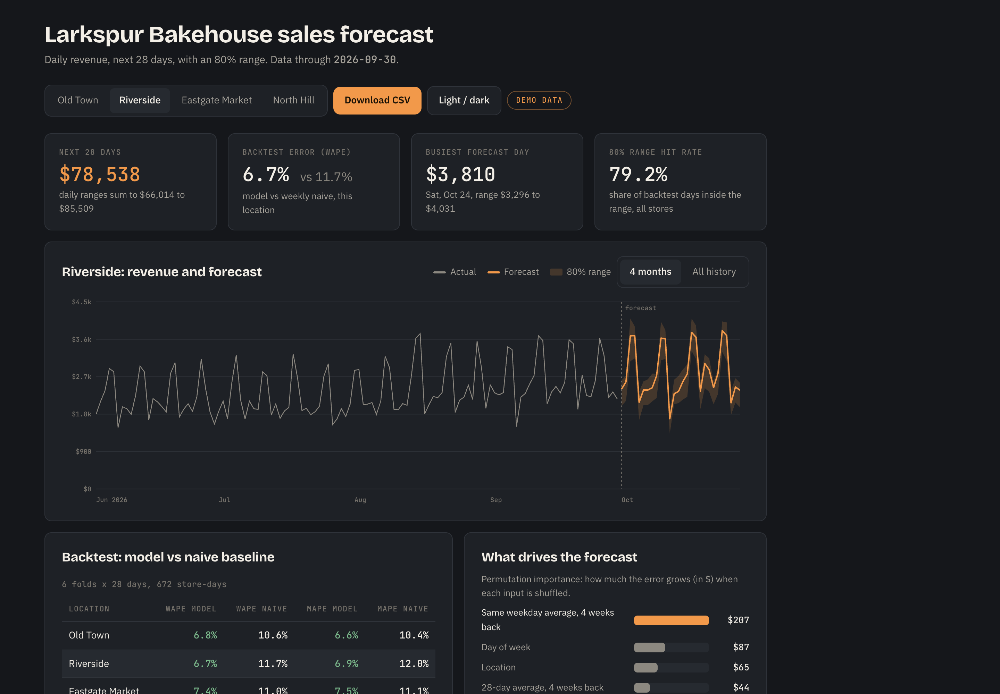

# Larkspur Bakehouse: tomorrow's bake list

**Live report:** https://vanthienha199.github.io/larkspur-sales-forecast/

A demand forecasting project for Larkspur Bakehouse, an invented four-location bakery, on synthetic daily sales that behave like real ones: weekly and yearly seasonality, US holidays with closures and a rush the day before, planned promotions, a store that opened in March 2025, a location closed on Mondays, and a 12-day point-of-sale outage that is kept as missing data. A gradient boosting model forecasts each store's daily revenue 28 days ahead, using calendar, promo and lagged-sales features where every lag is at least 28 days old, with an 80% range from quantile models calibrated by conformal prediction on held-out days.

Results from the 6-fold rolling backtest (6 x 28 days, 672 store-days), compared with a weekly naive baseline that repeats the last week:

| | Model | Weekly naive |
|---|---|---|
| WAPE | 6.9% | 11.3% |
| MAPE, open days | 7.0% | 11.3% |
| 80% range, share of days inside | 79.2% | |
| Bias | -1.3% | |

Run it with `pip install -r requirements.txt`, then `python -m forecast.run` to rebuild the data, backtest, forecast and report (`data/metrics.json`, `data/forecast_next_28_days.csv`, `site/`), and `python -m pytest tests` for the 13 tests: data quirks, no leakage from inside the horizon, the metric formulas, the baseline, forecast bounds and closures, and the model beating the baseline on a holdout. Open `site/index.html` and the page leads with tomorrow's bake list for the chosen shop, counts per product with the range the forecast allows, rounded up to whole trays. The chart sits below it, with planned promotions and holidays annotated, and the backtest table is at the foot. Pick any of the 28 days, print the list on one page, or download that store's forecast as CSV.

The model forecasts revenue, because that is what the till records and what the backtest scores. `forecast/products.py` turns a day's revenue forecast into units using the shop's own menu prices and a weekday mix, so the baker gets trays rather than dollars. That conversion is arithmetic, not a second model, and the page says so. A GitHub Actions workflow runs the tests, rebuilds everything and publishes the report on every push.

The bakery and every number are invented. Built by Ha Le as a forecasting demo.

